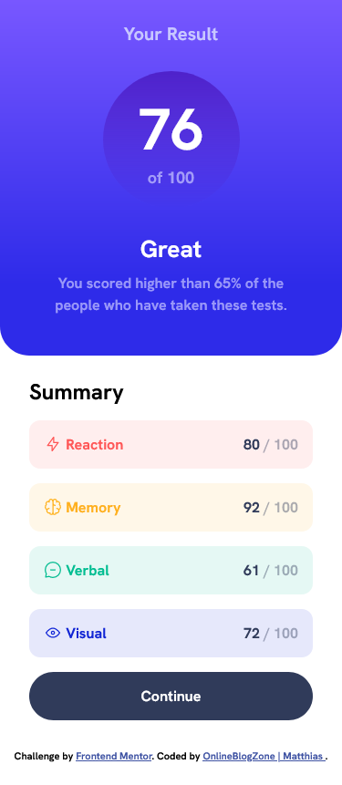
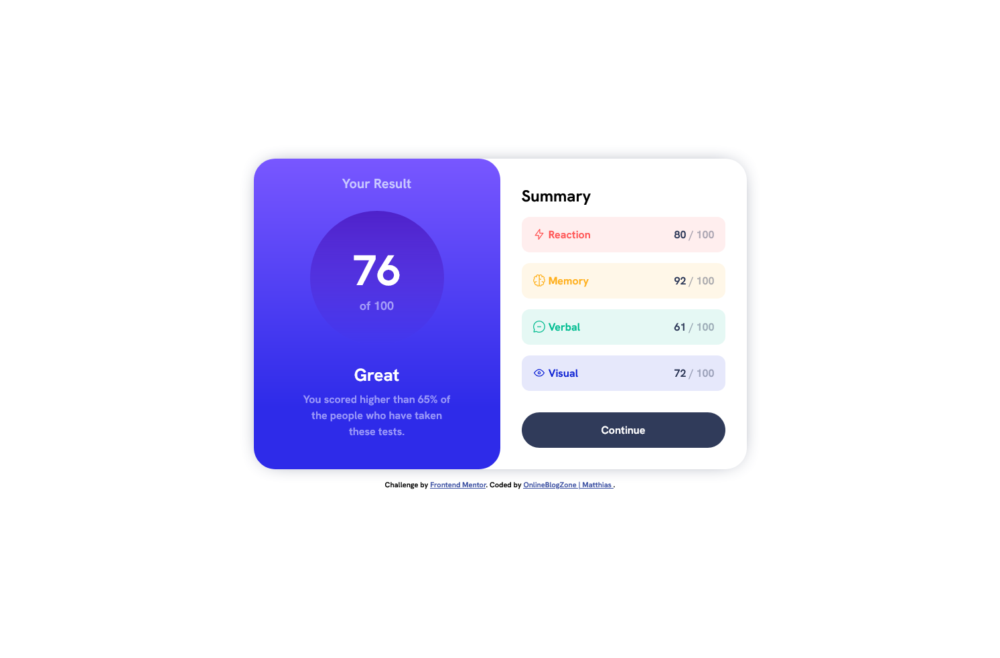

# Frontend Mentor - Results Summary component solution

This is a solution to the [Results Summary component challenge on Frontend Mentor](https://www.frontendmentor.io/challenges/results-summary-component-CE_K6s0maV/hub). Frontend Mentor challenges help you improve your coding skills by building realistic projects. 

## Table of contents

- [Overview](#overview)
  - [Screenshot](#screenshot)
  - [Links](#links)
- [My process](#my-process)
  - [Built with](#built-with)
  - [What I learned](#what-i-learned)
  - [Continued development](#continued-development)
  - [Useful resources](#useful-resources)
- [Author](#author)
- [Acknowledgments](#acknowledgments)

## Overview
This README will provide insight and information abou my solution for the Results Summary challenge hosted by [Frontend Mentor](https://www.frontendmentor.io/).

### Screenshot

### Links

- Solution URL: 

## My process
- TODO

### Built with

- Pure HTML
- Pure CSS
- BEM methodology
- Flexbox
- Mobile-first workflow

### What I learned
- TODO

### Continued development
- TODO

### Useful resources

- [The BEM documentation](https://getbem.com/introduction/) - Since it was a refresher on how the BEM methodology works, the documentation is always a good thing to have open.
- [PX to REM converter](https://nekocalc.com/px-to-rem-converter) - I didn't quite need it for this challenge specific but I still want to give a mention to this for the people who, like me, struggle with basic maths.

## Author

- Website - [Matthias](https://onlineblogzone.com)
- Frontend Mentor - [@onlineblogzone](https://www.frontendmentor.io/profile/onlineblogzone)
- Twitter - [@Online.Blog.Zone](https://www.twitter.com/OnlineBlogZone)